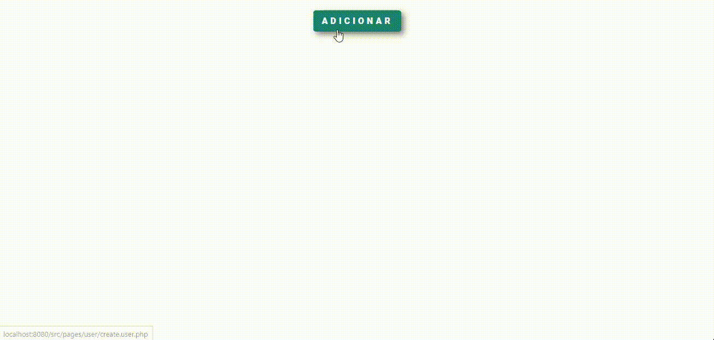
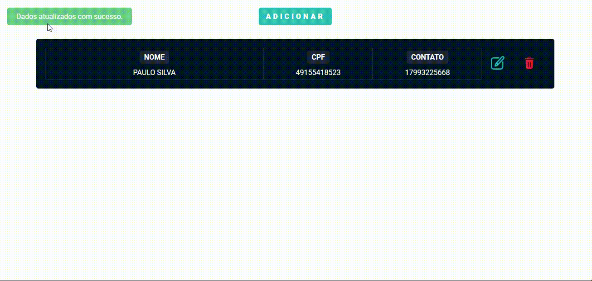

# Como rodar a aplicação

* Clone o repositório rodando o seguinte comando no terminal
~~~
git clone https://github.com/Alison-Rodrigues/crud-php-postgres.git
~~~
* Inicie seu servidor PostgreSQL
* Edite o arquivo config.php e altere os dados de conexão com o banco de dados
~~~~
$db_host = 'HOST AQUI';
$db_name = 'NOME DO BANCO DE DADOS CRIADO';
$db_port = PORTA EM QUE O SERVIDOR POSTGRES ESTÁ RODANDO;
$db_user = 'NOME DO USUÁRIO';
$db_password = 'SENHA';
~~~~
* Execute o script contido no arquivo scriptdb.sql no seu gerenciador do banco para criar a tabela
* Para subir um servidor PHP e visualizar a aplicação rodando, execute o seguinte comando no terminal
~~~~
php -S localhost:8080
~~~~
* Feito isso, acesse o endereço no navegador e prontinho!

---
### CREATE

### UPDATE

### DELETE

---
## Tecnologias utilizadas
* PHP
* HTML5
* CSS3
* PostgreSQL

